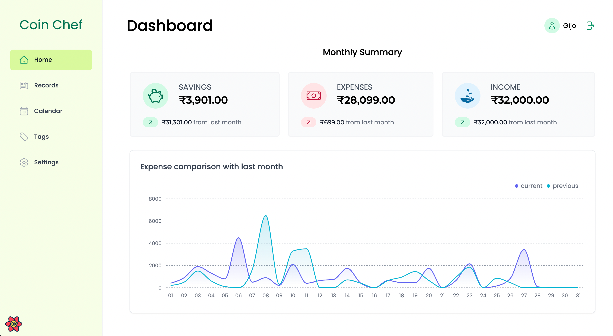
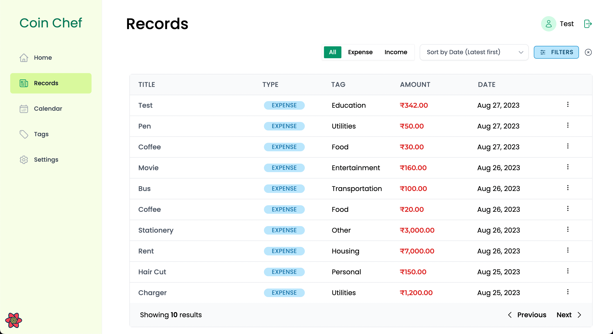
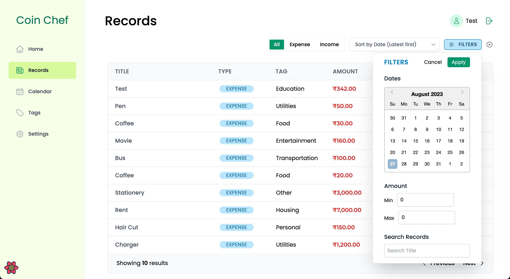
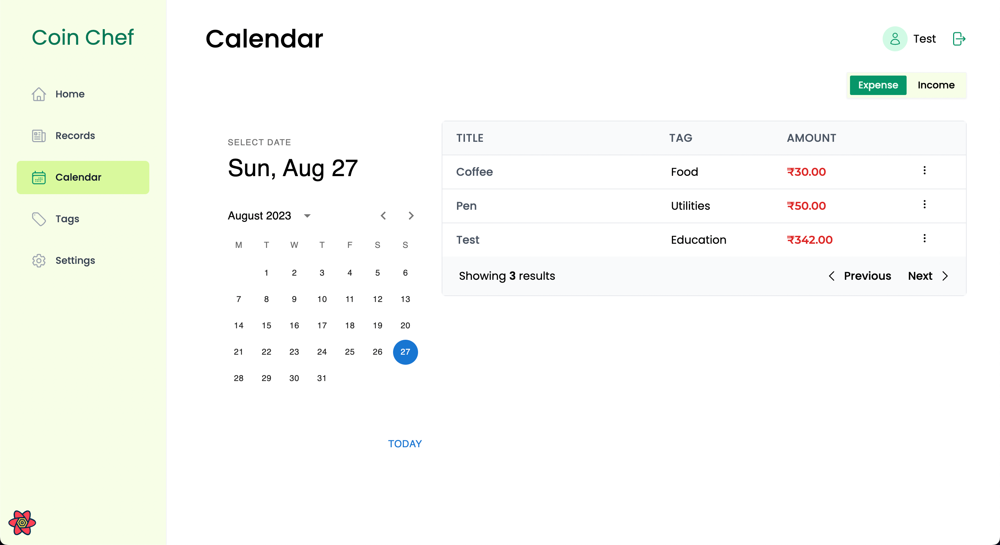
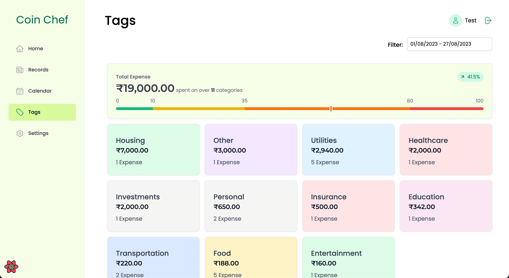
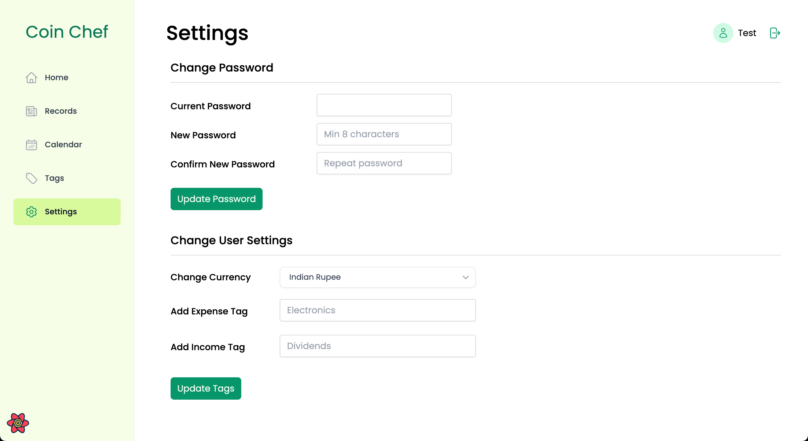

# CoinChef | Budget Tracker React Application

## Table of contents

- [Links](#links)
- [Overview](#overview)
- [Features](#features)
- [Features To Implement](#features-to-implement)
- [Built with](#built-with)
- [To run the app on Local Server](#to-run-the-app-on-local-server)
- [Author](#author)

## Links

- [Live Site URL](https://coin-chef-react.vercel.app/)

## Overview

- This is a React Budget Tracker Application integrated with [my other Budget Tracker API Backend project](https://github.com/acgeoffrey/budget-tracker-api). It contains dashboard with monthly summary, records page where all expense and income records are displayed, a calendar page where records of the selected date will be displayed and Category summary page.

## Features

### Dashboard

### Records

### Calendar

### Tag

### User and Authentication

### Features To Implement

- More graphs to compare to records between current month and previous month.
- Graph to visualize the tag expenses through the month.
- Better Pagination
- Budget Planner
- Dark Mode
- Responsive Design
- Add Subscription tracking.
- Add Google OAuth.
- Upload bills and upload avatars.

## Built with

- React, Tailwind CSS
- ReactQuery, React Hook Form
- Tremor, Material UI

## To run the app on Local Server

- Install all needed npm dependencies with `npm install`.
- Save the following environmental variables in a .env.local file.

  - VITE_API_URL (Connect with the API)

- "npm run dev"
- Server should run on [http://localhost:5173/](http://localhost:5173/).

## Author

Geoffrey
